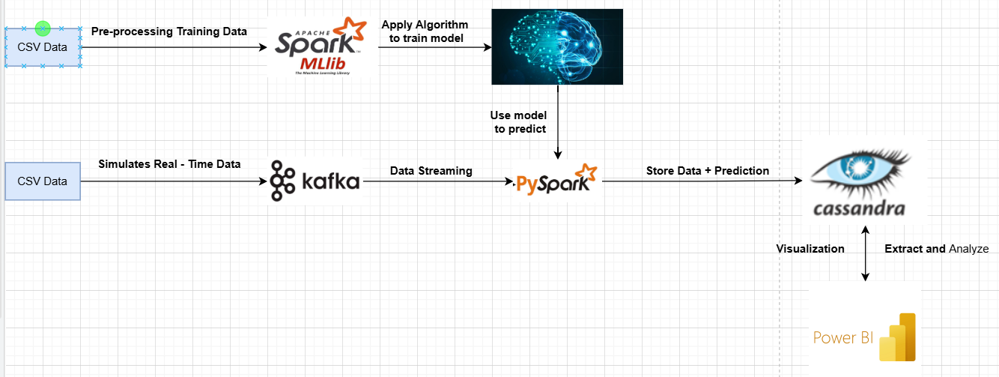

## Streaming Fraud Detection System

### Introduction
This project is a **real‑time credit‑card fraud detection system** built with Apache Kafka, PySpark, PostgreSQL, Streamlit and Docker.

The pipeline is:
- **Kafka Producer** (`src/kafka/kafka_producer.py`) streams simulated transactions from the Kaggle dataset.
- **Spark Streaming** (`src/spark/spark_streaming.py`) applies a trained **Random Forest** model to classify each transaction as fraud / non‑fraud and writes results to PostgreSQL.
- **PostgreSQL** stores predictions in the `fraud_predictions` table.
- **Streamlit dashboard** (`src/streamlit_app.py`) reads from PostgreSQL and provides real‑time monitoring and analytics.

The model is trained in the notebook `notebooks/Modeling.ipynb` using PySpark on the Kaggle *Fraud Detection* dataset.

### Model Results
On the evaluation set (after handling class imbalance with undersampling + class weights), the **Random Forest** model achieves approximately:
- **AUC‑ROC**: **0.9939**
- **AUC‑PR**: **0.9597**
- **Precision**: **0.9141**
- **Recall**: **0.8945**
- **F1‑Score**: **0.9042**

These metrics indicate the model is highly effective at detecting fraudulent transactions while maintaining a good balance between precision and recall. Comparative experiments with a Gradient Boosted Trees (GBT) model are included in `Modeling.ipynb`, but the deployed model in `src/model/rf_model` is the Random Forest pipeline.

You can also refer to the figures in the `images/` folder (e.g. updated confusion matrix and performance graphs) for visual summaries of model performance.

---

### System Architecture


#### Core Components
- **Apache Kafka**: Real‑time streaming of transaction data.
- **PySpark (Structured Streaming)**: Distributed feature engineering and ML inference over the stream.
- **PostgreSQL**: Persistent storage of predictions and transaction history.
- **Docker / Docker Compose**: Containerization and orchestration of all services.
- **Streamlit**: Interactive web UI for monitoring and analytics.

---

### System Requirements
- Docker & Docker Compose
- Python 3.8+ (for local development / Streamlit)
- Git

---

### Quick Start with Docker Compose

#### 1. Clone repository
```bash
git clone https://github.com/your-username/Streaming-Fraud-Detection.git
cd Streaming-Fraud-Detection
```

#### 2. Start all services
All core services are defined in `docker-compose.yml` and can be started with:

```bash
docker-compose up -d
```

This will:
- Start **Kafka/ZooKeeper** and the **Kafka producer** (streaming from `fraudTest.csv`).
- Start **Spark streaming** job that reads from Kafka, applies the model in `src/model/rf_model`, and writes to PostgreSQL.
- Start **PostgreSQL** with the schema created from `src/postgres/init.sql`.

You can verify container status with:
```bash
docker-compose ps
```

To see logs for a specific service (e.g. Spark streaming):
```bash
docker-compose logs -f spark-streaming
```

#### 3. Access the Streamlit Dashboard
The repository already includes `Dockerfile.streamlit`, and `docker-compose.yml` can be configured to run it as a separate service.

If the `streamlit` service is defined in `docker-compose.yml`, access the dashboard at:
- `http://localhost:8501`

Alternatively, you can run Streamlit locally (without Docker):
```bash
pip install -r requirements.txt
streamlit run src/streamlit_app.py
```

By default the dashboard connects to PostgreSQL using the environment variables:
- `POSTGRES_HOST` (default: `postgres` when running in Docker)
- `POSTGRES_DB` (default: `streaming`)
- `POSTGRES_USER` (default: `postgres`)
- `POSTGRES_PASSWORD` (default: `password`)
- `POSTGRES_PORT` (default: `5432`)

Make sure these values match the configuration in your `docker-compose.yml`.

---

### Data Flow
When the system is up and running, the data flow is:
1. **Data generation**: `src/kafka/kafka_producer.py` reads from `fraudTest.csv` and publishes JSON messages to the Kafka topic `transaction_data`.
2. **Streaming processing**: `src/spark/spark_streaming.py` reads from Kafka, applies feature engineering (`src/spark/spark_utils.py`), loads the trained Random Forest pipeline from `src/model/rf_model`, and generates predictions and fraud probabilities.
3. **Storage**: Spark writes results to PostgreSQL table `fraud_predictions` via JDBC.
4. **Visualization**: `src/streamlit_app.py` queries `fraud_predictions` and displays:
   - Real‑time metrics (total transactions, fraud count, fraud rate, average amount).
   - Time‑series charts of transactions and frauds.
   - Distribution of fraud by category and amount range.
   - Heatmaps and top‑merchant analysis.
   - Search and drill‑down views for individual transactions.

---

### Project Structure
```text
.
├── config/                     # Configuration files (e.g. Spark, Cassandra)
├── Encoder/                    # Label encoder artifacts (if used in experiments)
├── images/                     # Architecture, confusion matrix, performance plots
├── notebooks/                  # EDA and model training notebooks
│   ├── DataClearning_and_EDA.ipynb
│   └── Modeling.ipynb
├── src/
│   ├── kafka/
│   │   ├── Dockerfile          # Kafka client / producer image
│   │   ├── kafka_producer.py   # Transaction data producer
│   │   └── requirements.txt
│   ├── spark/
│   │   ├── Dockerfile          # Spark streaming image
│   │   ├── spark_streaming.py  # Streaming job (Kafka → RF model → PostgreSQL)
│   │   └── spark_utils.py      # Feature engineering helper functions
│   ├── postgres/
│   │   └── init.sql            # Database & table initialization
│   ├── model/
│   │   └── rf_model/           # Trained Random Forest pipeline (Spark ML)
│   ├── streamlit_app.py        # Real‑time monitoring dashboard
│   └── utils/
│       └── utils.py            # (Optional) generic utilities
├── Dockerfile.streamlit        # Streamlit service Dockerfile
├── docker-compose.yml          # Docker Compose orchestration
├── LICENSE
├── README.md                   # Project documentation
├── requirements.txt            # Python dependencies (local/dev)
└── postgres_test.py            # Helper script to test PostgreSQL connection
```

If you want to keep the repository lean, you can treat the following as **optional / development‑only** and exclude them from production deployments:
- `notebooks/` (used for EDA and model training only).
- `postgres_test.py` (manual connection testing utility).
- `Encoder/LE_model_v1.pkl` (only needed if using that specific encoder variant in other experiments).

---

### Troubleshooting

#### Database connection issues
- Check if PostgreSQL is running: `docker-compose ps`.
- Inspect logs: `docker-compose logs postgres`.
- Use `postgres_test.py` to verify connection and table structure:
  ```bash
  python postgres_test.py
  # hoặc
  POSTGRES_HOST=localhost python postgres_test.py
  ```

#### No data in dashboard
- Ensure the Kafka producer container is running and streaming: `docker-compose logs kafka-client`.
- Check Spark streaming logs to confirm batches are processed and written to PostgreSQL: `docker-compose logs spark-streaming`.
- Verify that `fraud_predictions` has rows (via `postgres_test.py` or psql client).

#### Port conflicts
Make sure the following ports are free before starting Docker Compose:
- `9092` (Kafka)
- `2181` (Zookeeper)
- `7077`, `8080` (Spark, if exposed)
- `5432` (PostgreSQL)
- `8501` (Streamlit)

---

### Stopping the System
To stop all services:
```bash
docker-compose down
```

To stop all services and remove volumes (this **deletes all stored data**):
```bash
docker-compose down -v
```

---

### Contributing
Contributions are welcome. Please feel free to submit issues or pull requests for:
- Improvements in feature engineering or model training.
- Enhancements to the Streamlit dashboard UX.
- Infrastructure and deployment optimizations.

---

### License
This project is distributed under the MIT License. See the `LICENSE` file for more details.
