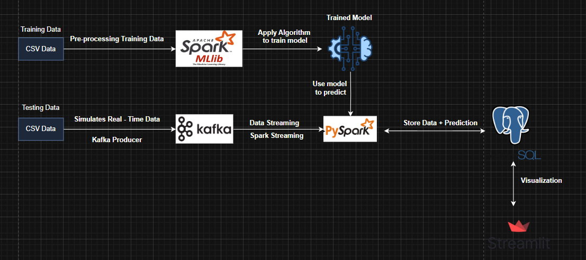

# Streaming Fraud Detection System

## Introduction
A real-time fraud detection system built using modern technologies such as Apache Kafka, PySpark, PostgresQL, and Docker. The system includes a live dashboard created with Streamlit for reporting and analytics.

## System Architecture


### Core Components
- **Apache Kafka**: Real-time data stream processing
- **PySpark**: Distributed data processing and ML model application
- **PostgresQL**: Data storage
- **Docker**: Service containerization and orchestration
- **Streamlit**: Data visualization and analytics

## System Requirements
- Docker and Docker Compose
- Python 3.8+
- Git

## Installation and Setup

### 1. Clone repository
```bash
git clone https://github.com/your-username/Streaming-Fraud-Detection.git
cd Streaming-Fraud-Detection
```

### 2. Start services using Docker Compose
All services are containerized and can be started with a single command:

```bash
docker-compose up -d
```

This command will:
- Download necessary Docker images
- Build custom images (Kafka client, Spark streaming)
- Start all services defined in the docker-compose.yml file

### 3. Check service status
Ensure all containers are running properly:

```bash
docker-compose ps
```

All services should show a status of "Up". If any service is not running, check the logs:

```bash
docker-compose logs [service-name]
```

For example, to check the Kafka producer logs:
```bash
docker-compose logs kafka-client
```

### 4. Access the Streamlit Dashboard

#### Option 1: Run Streamlit locally
If you want to run the Streamlit app directly on your machine:

```bash
# Install required dependencies
pip install -r requirements.txt

# Run the Streamlit app
streamlit run src/streamlit_app.py
```

The Streamlit dashboard will open automatically in your browser, or you can access it at http://localhost:8501

#### Option 2: Add Streamlit to Docker Compose
Create a `Dockerfile.streamlit` in the project root:

```dockerfile
FROM python:3.9

WORKDIR /app

COPY requirements.txt .
RUN pip install --no-cache-dir -r requirements.txt

COPY . .

EXPOSE 8501

CMD ["streamlit", "run", "src/streamlit_app.py", "--server.address", "0.0.0.0"]
```

Then add the following service to your `docker-compose.yml`:

```yaml
  streamlit:
    build:
      context: .
      dockerfile: Dockerfile.streamlit
    container_name: streamlit
    depends_on:
      - postgres
      - spark-streaming
    ports:
      - "8501:8501"
    environment:
      - POSTGRES_HOST=postgres
    networks:
      - spark-net
```

Restart your services:
```bash
docker-compose up -d
```

Access the Streamlit dashboard at http://localhost:8501

## Data Flow
When the system is properly set up, the data will flow as follows:

1. **Kafka Producer** generates simulated transaction data and sends it to Kafka
2. **Spark Streaming** processes the data from Kafka, applying the ML model to detect fraudulent transactions
3. **PostgreSQL** stores the results in the `fraud_predictions` table
4. **Streamlit Dashboard** reads from PostgreSQL and displays reports and visualizations

## Troubleshooting

### Common Issues

1. **Database Connection Issues**
   - Check if PostgreSQL container is running: `docker-compose ps`
   - Verify database initialization: `docker-compose logs postgres`
   - Ensure the database name, user, and password match those in the application

2. **No Data in Dashboard**
   - Verify Kafka producer is sending data: `docker-compose logs kafka-client`
   - Check Spark streaming is processing data: `docker-compose logs spark-streaming`
   - Confirm data is being written to PostgreSQL

3. **Port Conflicts**
   - If any service fails to start due to port conflicts, ensure the following ports are available:
     - 9092 (Kafka)
     - 2181 (Zookeeper)
     - 7077, 8080 (Spark)
     - 5432 (PostgreSQL)
     - 8501 (Streamlit)

4. **Memory Issues**
   - If containers fail due to memory constraints, adjust memory settings in docker-compose.yml or increase Docker's allocated memory

### Viewing Logs
To continuously monitor logs from a specific service:

```bash
docker-compose logs -f [service-name]
```

## Stopping the System
To stop all services:

```bash
docker-compose down
```

To stop and remove all data volumes (will delete all stored data):

```bash
docker-compose down -v
```

## Project Structure
```
.
├── src/                # Main source code
│   ├── kafka/         # Kafka producer code
│   ├── spark/         # Spark streaming code
│   ├── postgres/      # Database initialization
│   ├── model/         # ML model files
│   ├── streamlit_app.py # Streamlit dashboard
│   └── utils/         # Utility functions
├── data/             # Sample data and resources
├── config/           # Configuration files
├── images/           # Images and documentation
├── requirements.txt  # Python dependencies
└── docker-compose.yml # Docker configuration
```

## Contributing
Contributions are welcome. Please feel free to submit issues or pull requests.

## License
This project is distributed under the MIT License. See `LICENSE` file for more details.
